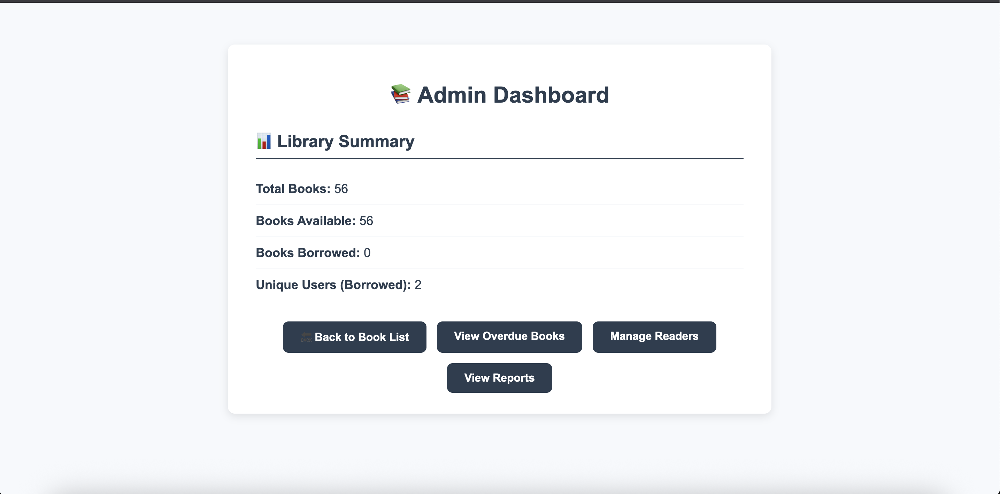

# Library Management System


---


A PostgreSQL-based Library Management System built with Django. This system allows admins and users to manage, borrow, and track books efficiently.

---

## 🌐 Live Demo

Try the live project here: [https://amanshinde.pythonanywhere.com/](https://amanshinde.pythonanywhere.com/)


## 📁 Project Structure
- `library/` – Django app with models, views, forms, templates.
- `library_mgmt/` – Django project configuration.
- `templates/` – Custom HTML templates with improved UI/UX.
- `static/` – Static assets like CSS and JS.

---

## ✅ Features
### Core Functionality
- 📚 **Book Catalog** – List, search, filter, and view book availability.
- 🙋‍♂️ **Student/Reader Records** – Add, edit, and manage users.
- 🔁 **Borrow/Return System** – Borrow available books, track borrowed history.
- 🛒 **My Bag** – Add books to bag before borrowing.

### Admin Features
- 🙋‍♂️ **Admin Dashboard** – Summarizes book and borrow stats.
- 📊 **Admin Reports** – Chart.js graphs for most borrowed books, active readers, availability.
- 📂 **Export Readers to CSV** – Export filtered reader data.
- 📧 **Email Reminders** – Sends overdue reminders.

### Account & Security
- 🔐 **Login/Register** – Secure auth using Django's auth system.
- 🔄 **Password Reset** – Email-based reset functionality.
- 🧑‍🎓 **Profile Editing** – Change name, avatar, password, etc.

### UI/UX
- 🎨 Fully styled UI with improved responsiveness.
- 📱 Mobile-friendly templates.

---

---

## 📸 Project Screenshots

Here are key features of the Library Management System demonstrated via screenshots:

### 🏠 Homepage


### 📚 Book List with Search & Filters


### 📦 My Bag (Selected Books)


### 📖 Borrowed Books View


### 👥 Readers List (Admin Only)


### 📊 Admin Dashboard


### 📈 Admin Reports – Most Borrowed & Active Users


---


## 🛠️ Technologies Used
- Django (Backend Framework)
- PostgreSQL (Database)
- Bootstrap 4 & Custom CSS (Frontend)
- Chart.js (Admin Analytics Dashboard)
- Python 3.13

---

## 🚀 Getting Started
### 1. Clone Repo & Setup
```bash
git clone https://github.com/amanshinde1/library-management-system.git
cd library-management-system
python3 -m venv .venv
source .venv/bin/activate
pip install -r requirements.txt
```

### 2. Setup PostgreSQL
Create a PostgreSQL database and configure it in `settings.py`:
```python
DATABASES = {
  'default': {
    'ENGINE': 'django.db.backends.postgresql',
    'NAME': 'your_db_name',
    'USER': 'your_username',
    'PASSWORD': 'your_password',
    'HOST': 'localhost',
    'PORT': '5432',
  }
}
```

### 3. Run Migrations & Server
```bash
python manage.py makemigrations
python manage.py migrate
python manage.py runserver

Open http://localhost:8000 in your browser to see the app.
```

---

## 👨‍💻 Author
**Aman Shinde**

---

## 📄 License
This project is licensed under the MIT License.

---

